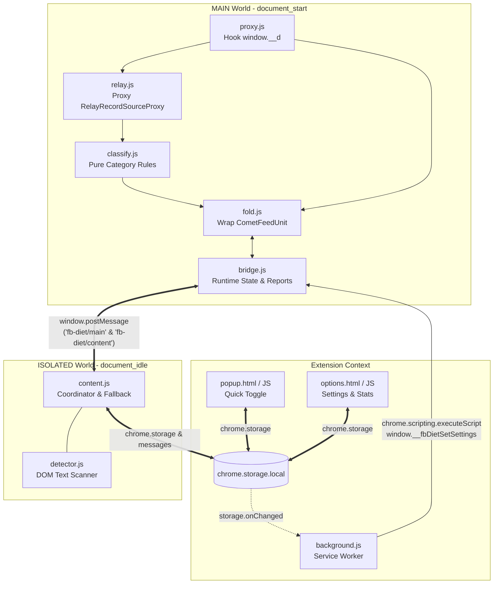

# FB Diet - Developer Guide & Architecture Documentation

This document describes the internal architecture, runtime data flow, debugging techniques, and testing conventions for **FB Diet**.

---

## 1. High-Level Architecture

FB Diet utilizes a **Dual-World Architecture** under Chrome Manifest V3 to balance high-speed React-level interception with secure Chrome extension APIs:



### Core Design Principles

1. **CSP Relaxation for Reliable Injection (`rules.json`)**: Uses `declarativeNetRequest` to remove Facebook's restrictive CSP header limits, enabling synchronous function compiling for module source hooks.
2. **Authoritative Relay Store Capture**: Automatically rewrites `relay-runtime/store/RelayPublishQueue` on module definition to assign the live `RelayRecordSourceProxy` instance to `window.___rs`.
3. **Non-Destructive React Tree (1x1 Squash)**: Feed units are never removed or destroyed. `fold.js` wraps the original component and applies a `1x1` squash container with `overflow: hidden`, ensuring Facebook video players and IntersectionObserver monitors stay stable.
4. **Dual Engine Modes (Proxy Mode vs DOM Mode)**: Users can toggle between high-speed MAIN world Proxy mode (default) and traditional ISOLATED world DOM mode in the Options page.
5. **Resilient Lifecycle (`shutdown`)**: To eliminate `Extension context invalidated` errors when developers reload the extension, open tabs safely disconnect `MutationObserver` instances, clear pending timers, and silence storage flushes.

---

## 2. Directory & Module Breakdown

```text
fb-diet/
├── manifest.json              # MV3 configuration with dual-world content scripts & DNR
├── rules.json                 # DeclarativeNetRequest rule relaxing Facebook CSP
├── package.json               # Test script and package metadata
├── README.md                  # User-facing summary and installation instructions
├── STRATEGY.md                # Classification strategy & decision log (zh-TW)
├── AGENTS.md                  # This architecture and developer reference (this file)
├── icons/                     # Extension asset icons
├── src/
│   ├── background/
│   │   └── background.js      # Service Worker: initialization, tab broadcast
│   ├── content/
│   │   ├── content.css        # Responsive styling for inline placeholders
│   │   ├── content.js         # Isolated world: storage sync, throttled stats, DOM fallback
│   │   └── detector.js        # Multilingual regexes & DOM heuristics for fallback
│   ├── i18n/
│   │   └── i18n.js            # Shared en / zh-TW dictionary for options & popup pages
│   ├── inject/
│   │   ├── proxy.js            # Hooks window.__d, wraps React components safely
│   │   ├── relay.js            # Intercepts Relay Record Store and evaluates field paths
│   │   ├── classify.js         # Pure functions mapping feed props + Relay to categories
│   │   ├── classify-retired.js # Retired rules kept for reference (never injected)
│   │   ├── bridge.js           # In-memory settings, postMessage router, expansion state
│   │   └── fold.js             # FBDietFold React decorator component & placeholder UI
│   ├── options/
│   │   ├── options.html       # Full dashboard & category toggles
│   │   ├── options.css        # Dark glassmorphic styles
│   │   └── options.js         # Live stats breakdown and configuration sync
│   └── popup/
│       ├── popup.html         # Compact extension toolbar popup
│       ├── popup.css          # Minimalist dark popup UI
│       └── popup.js           # Master toggle and options page navigation
└── tests/
    ├── harness.js             # Lightweight Node test assertion framework
    ├── run.js                 # Test runner discovering *.test.js
    ├── proxy.test.js          # Unit tests for proxy.js registration & hooks
    ├── relay.test.js          # Unit tests for relay.js path navigation
    ├── classify.test.js       # Unit tests for feed unit classification
    ├── i18n.test.js           # Unit tests for language dictionaries & fallback
    └── fold.test.js           # Unit tests for folding wrapper logic
```

### Main World Modules (`src/inject/`)

Loaded sequentially at `document_start` before Comet finishes loading:

- **`proxy.js` (`window.FBDietProxy`)**:
  - Intercepts `window.__d` (Comet module definer) via property getter/setter.
  - Matches requested module names (e.g. `CometFeedUnitErrorBoundary.react`).
  - Wraps component factories without modifying source text.
  - Exposes `getReact()` and diagnostic getters.
- **`relay.js` (`window.FBDietRelay`)**:
  - Uses a `Proxy` `construct` trap around `relay-runtime/mutations/RelayRecordSourceProxy`.
  - Maintains an LRU cache of the latest 6 record store proxies (`sources`).
  - Implements path evaluator supporting syntax:
    - `^field`: follow linked record ID.
    - `^^list[0].field`: access first item in linked record list.
    - `{$1}` / `{$args}`: dynamic query variables.
    - `*`: wildcard record lookups.
- **`classify.js` (`window.FBDietClassify`)**:
  - Pure deterministic classification functions.
  - Evaluates direct props first, followed by Relay paths.
  - `classifyFeedUnit(payload, context)` — `context.moduleName` is part of the decision (the Reels attachment wrapper never folds as Reels).
  - Supported categories (see STRATEGY.md for the full decision log):
    - `sponsored`: `^sponsored_data.ad_id`
    - `suggested`: `^^actors[0].subscribe_status === 'CAN_SUBSCRIBE'` (only this value). story_header is diagnostic-only evidence and NEVER decides a category (STRATEGY.md, decision #6; retired rules kept in `src/inject/classify-retired.js`)
    - `suggestedGroup`: `GroupsYouShouldJoinFeedUnit` / `GroupSuggestionsFeedUnit` or `^to.viewer_forum_join_state === 'CAN_JOIN'`
    - `reels`: the unit's OWN `__typename === 'ShowcaseFeedUnit'` (nested attachment records and the attachment-style module are excluded on purpose)
    - `stories` / `marketAds` / `searchingAds`: component-name markers in `fold.js`, not unit classification
- **`bridge.js` (`window.FBDietBridge`)**:
  - Owns in-page expand/collapse state (`expandedSet`).
  - Manages deduplication sets (`reportedBlockedSet`, `reportedUnknownSet`) to prevent redundant storage writes.
  - Handles `window.postMessage` communication between MAIN and ISOLATED worlds.
  - Accepts immediate settings push via `window.__fbDietSetSettings`.
- **`fold.js` (`window.FBDietFold`)**:
  - Wraps target feed unit components using `React.createElement`.
  - If a unit matches an active filter and is not expanded, renders an inline `FBDietFold` bar and sets the original element container to `display: none`.
  - Preserves Relay query subscriptions and React component identity.

### Isolated World Modules (`src/content/`)

- **`content.js`**:
  - Listens for `fb-diet/main` messages (`ready`, `blocked`, `unknown`).
  - Persists a capped diagnostic log of classification events to `chrome.storage.local` (`fbDietLog`, last 300 entries, batched flush).
  - Manages a 3-second throttled buffer (`countBuffer`) to batch-update `chrome.storage.local`.
  - Disables DOM scanning as soon as `ready` is received from MAIN world.
  - Implements `shutdown()`: called on context invalidation to gracefully halt observers and timers.
- **`detector.js` (`window.FBDietDetector`)**:
  - Fallback text parser with multilingual keyword dictionaries (Sponsored, Suggested, etc.).
  - Handles SVG text masking, aria-labels, and obfuscated spans.

### Shared i18n Module (`src/i18n/`)

- **`i18n.js` (`window.FBDietI18N`)**: Dependency-free dictionary module shared by the pages that render UI text.
  - Loaded via `<script>` from `src/options/options.html` and `src/popup/popup.html`. It is intentionally NOT in
    `manifest.json`'s content-script lists, so neither the ISOLATED content scripts nor the MAIN world have it.
  - Ships `en` and `zh-TW`; every other locale normalizes to `en` (`normalize`, `detect`, `FALLBACK`).
  - API: `t(key, lang?)`, `detect()`, `getLang()`, `setLang(code)`, `normalize(code)`, `LOCALES`, `FALLBACK`.
  - `t()` resolves the requested language, then English, then returns the key itself, so an unknown key is
    visible instead of blank. Options/popup drive DOM text through `data-i18n` / `data-i18n-title` attributes.
  - Feed placeholder badges stay hardcoded in `fold.js` (`CATEGORY_META.badgeText`) on purpose: the MAIN world
    has no i18n module (`tests/i18n.test.js` asserts the badge keys were trimmed from the shared dictionary).

---

## 3. Runtime Data & Control Flows

### 1. Initialization Sequence

```text
Tab Navigates to facebook.com
  │
  ├─► [MAIN World: document_start]
  │     1. proxy.js attaches getter/setter to window.__d
  │     2. relay.js queues wrapExports for RelayRecordSourceProxy
  │     3. classify.js binds setRelayReader
  │     4. bridge.js registers message listener
  │     5. fold.js registers CometFeedUnitErrorBoundary.react with proxy
  │
  ├─► [Background Service Worker]
  │     Pushes saved settings to tab via chrome.scripting (window.__fbDietSetSettings)
  │
  └─► [ISOLATED World: document_idle]
        1. content.js boots, starts 8s fallback timer
        2. Sends ping { source: 'fb-diet/content', type: 'ping' }
        3. MAIN world replies ready { source: 'fb-diet/main', type: 'ready' }
        4. content.js marks proxyActive = true and cancels fallback timer
```

### 2. Feed Unit Classification & Folding Flow

```text
Comet renders CometFeedUnitErrorBoundary
  │
  ▼
FBDietFold wrapper executes
  │
  ├─► Extract feed unit ID & props
  ├─► Check bridge.isExpanded(unitId)
  │     └─► If true: return original component untouched
  │
  ├─► FBDietClassify.classifyFeedUnit(payload)
  │     ├─► Inspect props directly
  │     └─► Read Relay paths via FBDietRelay.read(...)
  │
  ├─► Matched active category?
  │     ├─► NO:
  │     │     Report unknown (if suspicious) -> return original element
  │     │
  │     └─► YES:
  │           1. bridge.reportBlocked(unitId, category)
  │           2. postMessage to content.js (queued for 3s storage flush)
  │           3. Return placeholder bar + hidden original tree (display: none)
```

### 3. Expand / Restore Lifecycle

When a user clicks **"Expand"** on a folded placeholder:
1. `fold.js` event handler calls `bridge.toggleExpanded(unitId, true)`.
2. Component triggers local React state rerender (`setExpanded(true)`).
3. The original tree becomes visible immediately with a **"Re-fold"** option on top.
4. The expanded state is kept in in-memory memory (`bridge.js`) keyed by `unitId`, surviving virtual scroll recycling without hitting disk storage.

---

## 4. Development & Debugging Workflow

### Avoiding "Extension context invalidated"

When developing and saving changes:
1. Go to `chrome://extensions/` and click the **🔄 Reload** button on **FB Diet**.
2. **Reload all open Facebook tabs**.
3. If an open tab is kept alive, `content.js` will trigger `shutdown()` automatically as soon as it detects `chrome.runtime?.id` is gone.

### In-Browser Diagnostic Consoles

FB Diet exposes rich diagnostic inspection helpers directly in the browser DevTools console.

#### MAIN World Inspection (Select `top` context in DevTools Console)

```javascript
// 1. Check proxy interception stats
window.FBDietProxy.getStats();
// => { intercepted: 142, patched: 1, hookRuns: 38, patchedModules: ["CometFeedUnitErrorBoundary.react"] }

// 2. Check Relay store capture status
window.FBDietRelay.isReady();         // => true
window.FBDietRelay.getSourceCount();  // => number of active store snapshots

// 3. Inspect recent classification reports
window.FBDietBridge.getRecentReports();
// => Array of { id, category, reason, evidence, at }

// 4. View intercepted errors
window.FBDietProxy.getErrors();
window.FBDietRelay.getLastError();
```

#### Verbose Logging via URL Query

Append `?fb_diet_debug=1` to any Facebook URL:
```text
https://www.facebook.com/?fb_diet_debug=1
```
This activates verbose `[FB Diet][MAIN]` console output for every intercepted unit, classified category, and bridge message.

#### ISOLATED World Inspection (Select `FB Diet` context in DevTools Console)

```javascript
// Check content script status & buffer
window.__fbDietStatus();
window.__fbDietReports();      // in-memory MAIN world reports

// Persistent diagnostic log (chrome.storage.local "fbDietLog", last 300 events)
window.__fbDietDumpLog();      // prints & returns the stored entries
window.__fbDietClearLog();     // wipes the log
```

#### Feed Probe Buttons (per-unit diagnostics)

Enable "Show Feed Probe Buttons" in the Options page (or open Facebook with `?fb_diet_debug=1`).
Every unit flowing through `FBDietFold` then shows a small ⧉ button in its top-right corner;
clicking it copies a JSON report of that unit:

- the classification result (`category`, `unitId`, `unitTypename`, `reason`, full `evidence`)
- the component module that produced the decision
- a depth-limited snapshot of the unit payload and the Relay record fields

Use it to diagnose missed folds (`classify.category: null` — check `reason`) and wrong folds
(`reason` maps back to the rule table in STRATEGY.md §3).

#### Options Debug Card (probe report analyzer)

The Options page has a second **DEBUG** card below DIET OPTIONS. It hosts the probe-button
toggle plus a report analyzer: paste a copied probe JSON, press **Analyze**, and the page shows
the captured classification side by side with a re-run of the CURRENT rules
(`FBDietClassify.classifyProbeReport(report)`, pure & Node-tested). Known limitation: the probe
snapshot contains only the first Relay record, so `^` / `^^` linked-record paths read as null on
re-run and the re-run may degrade to `unknown` — the captured verdict stays authoritative.

---

## 5. Testing Strategy

Unit tests run under **Node.js** with zero browser or DOM dependencies.

### Running the Test Suite

```bash
npm test
# or directly:
node tests/run.js
```

### Test Structure

- **`tests/harness.js`**: Minimalist test harness providing `ok`, `equal`, `deepEqual`, `throws`, and test summary reporting.
- **`tests/proxy.test.js`**: Validates `window.__d` interception, factory patching, error recovery, and multiple registration handling.
- **`tests/relay.test.js`**: Mocks Relay record stores and tests path query features (`^`, `^^`, `{$var}`, wildcards).
- **`tests/classify.test.js`**: Tests feed unit payloads against all classification rules (sponsored ads, suggestions, groups, reels, stories).
- **`tests/i18n.test.js`**: Loads `src/i18n/i18n.js` into a VM sandbox and validates language detection/normalization, dictionary lookups, unknown-key fallback, and the `setLang` round-trip.
- **`tests/fold.test.js`**: Tests wrapper generation, React element creation, and category metadata binding.

### Adding New Classification Rules

1. Define the Relay path or prop attribute in `src/inject/classify.js`.
2. Add the category mapping in `CATEGORY` and `SETTING_BY_CATEGORY`.
3. Add badge metadata in `src/inject/fold.js` (`CATEGORY_META`).
4. Add corresponding test fixture assertions in `tests/classify.test.js`.
5. Run `npm test` to verify zero regression across existing rules.

---

## 6. Coding & Contribution Rules

- **Code Comments**: All code comments and documentation headers must be written in **English**.
- **No Path Literals**: Never hardcode machine-specific absolute file paths in documentation or code.
- **Git Hygiene**: Do not perform automated Git commits without explicit developer approval.
- **Doc Ownership**: `AGENTS.md` (this file) is the developer/architecture reference and `README.md` stays user-facing (features, install, privacy) and links here; `STRATEGY.md` owns the classification decision log. Renaming or moving these files means updating every link and the tree in §2 in the same change.
- **Preserve React Tree**: Never manipulate Facebook's native React DOM nodes directly from the MAIN proxy; use pure React wrapper elements (`FBDietFold`).
