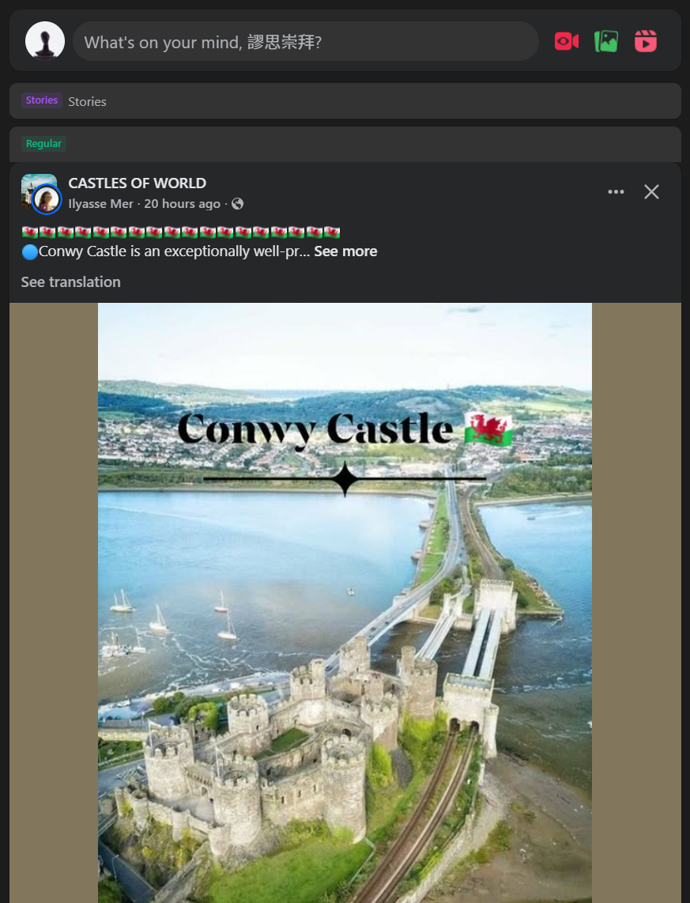
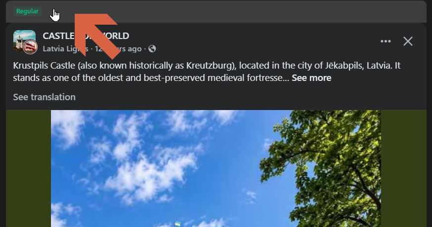
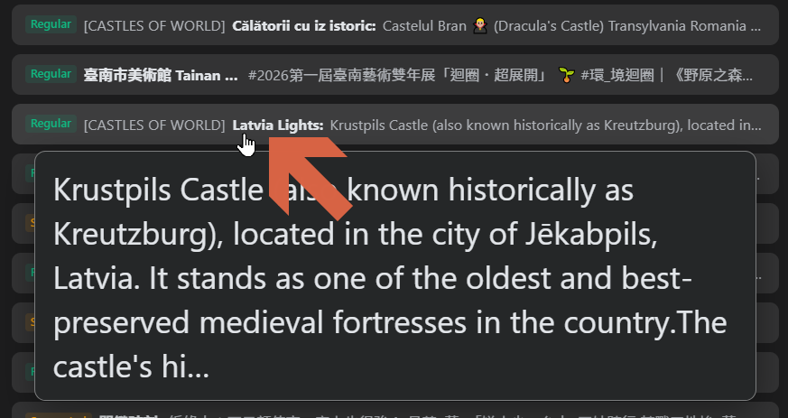
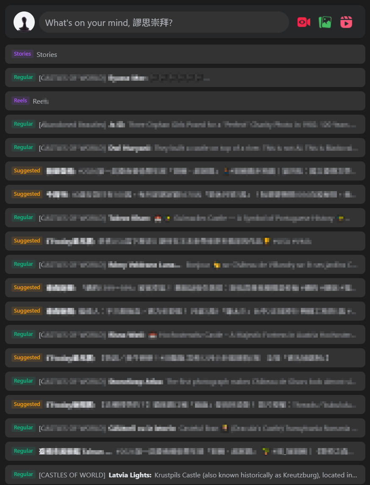
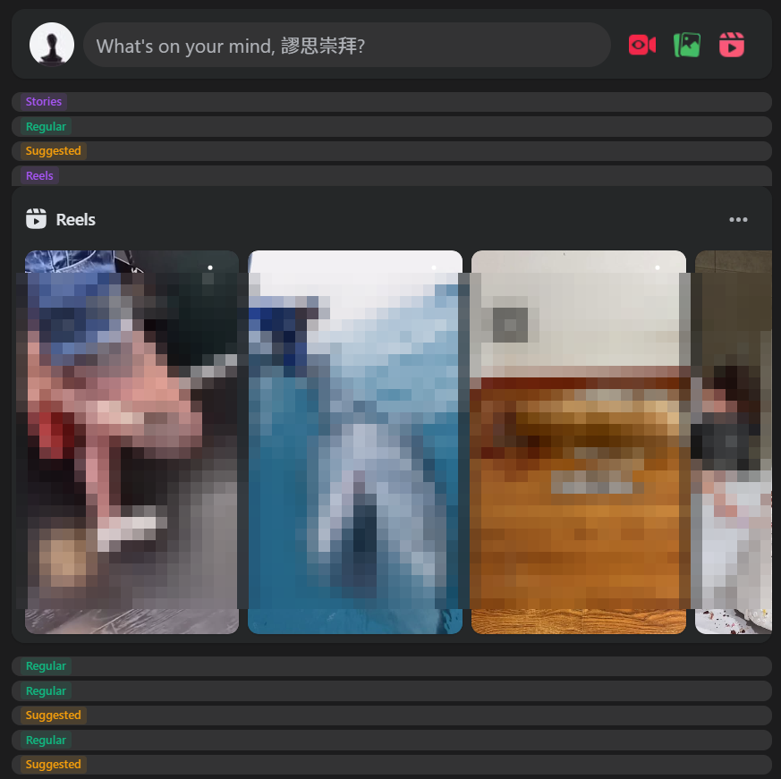
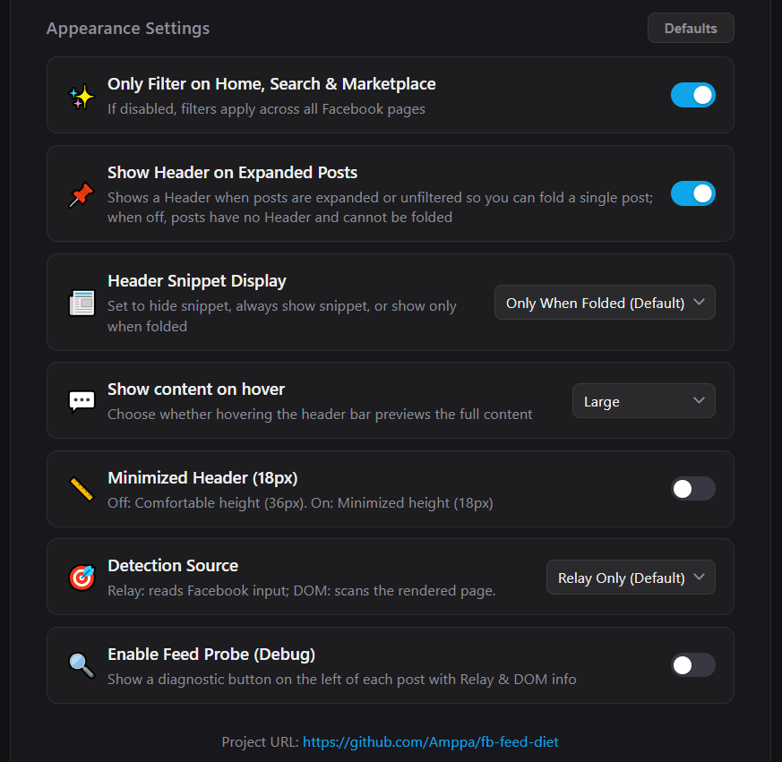

# FB Feed Diet - Clean Feed & Ads Declutter for Facebook™

A modern, lightweight Chrome Extension designed to put your Facebook feed on a clean, healthy diet.

Instead of abruptly wiping elements or breaking your feed, **FB Feed Diet** neatly folds sponsored posts, suggestions, and ads into elegant inline placeholders with seamless **one-click expand and restore**.

### 📸 Overview: Before & After

| Before (Cluttered Feed) | After (Clean Diet) |
| :---: | :---: |
|  |  |

---

## ✨ Features

- **Master Switch**: One-click global toggle to pause or resume diet filtering anytime.
- **💸 Fold Ads**: Folds sponsored posts, Marketplace listings, and search ads.
- **🤵 Fold Facebook Suggestions**: Folds recommended posts from people you don't follow ("Suggested for you").
- **🎬 Fold Reels & Stories**: Keeps your feed focused by folding Reels and Stories carousels.
- **👥 Fold Other Recommendations**: Folds group recommendations ("Groups you should join").
- **👤 Fold Regular Posts (Optional)**: Option to fold regular posts from accounts you follow for extreme focus.
- **One-Click Expand & Restore**:
  - Folded items are replaced with a sleek, non-intrusive placeholder bar matching Facebook's Light and Dark themes.
  - Hover over any placeholder bar to read the full post preview tooltip without expanding.
  - Click anywhere on the placeholder bar to reveal the original content; expanded posts can keep a header bar to let you collapse them back anytime.

| Single Post Header & Fold/Unfold | Hover Tooltip Preview (Large) |
| :---: | :---: |
|  |  |

| All Folded (Comfortable 36px) | Minimized Mode (Compact 18px) |
| :---: | :---: |
|  |  |  

- **🔎 Detection Source**: choose where posts are classified from — **Relay Only** (default, reads Facebook data directly) or **DOM Only** (scans the rendered page independently).
- **🌐 English / 繁體中文**: switch the Options and popup interface language.
- **Privacy-First & Ultra-Lightweight**:
  - Zero data collection, zero telemetry. All settings and statistics stay strictly on your local device.

---

## 🚀 Installation Guide

1. Download or clone this repository to your computer.
2. Open Google Chrome and navigate to `chrome://extensions/`.
3. Enable **Developer mode** in the top-right corner.
4. Click **Load unpacked** (載入未封裝項目).
5. Select the `fb-feed-diet` folder (or repository root).
6. Open [Facebook](https://www.facebook.com) and enjoy a clean, distraction-free feed!

### Firefox (128 or newer)

The same package also runs on Firefox — the MAIN-world content scripts require Firefox 128+ (`browser_specific_settings.gecko.strict_min_version`).

1. Build the package with `npm run package` (or use the repository folder directly).
2. Open Firefox and navigate to `about:debugging#/setup/runtime/this-firefox`.
3. Unzip the package first, then click **Load Temporary Add-on…** (暫時性載入附加元件) and select the extracted `manifest.json` (or the repository's).
4. Open [Facebook](https://www.facebook.com) and enjoy a clean feed!

> Temporary add-ons are unloaded when Firefox restarts — repeat step 3 to reload.

---

## 💡 How to Use

- **Quick Toggle**: Click the **FB Feed Diet** icon in your Chrome toolbar to turn filtering ON or OFF instantly.
- **Detailed Settings**: Click **"Options"** in the popup to customize which types of content to fold (e.g. keep Reels while folding Sponsored ads), adjust display preferences, and monitor diet statistics.

| Live Stats & Header | Feed Classifications | Appearance & Detection Source |
| :---: | :---: | :---: |
|  |  |  |

- **Expand a Post**: When a post is folded, click its placeholder bar to view it without reloading the page — hovering the bar previews the full post text — and click again to collapse it back.

---

## 🔒 Privacy & Permissions

- **Zero Data Collection**: FB Feed Diet does not collect, track, or transmit any user data, browsing history, or feed content.
- **100% Local Storage**: All settings and statistics are stored strictly on your local device (`chrome.storage.local`) with no backend servers or external telemetry.
- **Minimal Permissions**: Host permissions (`*://*.facebook.com/*`) cover the feed pages the extension runs on; `storage` keeps your settings and counters on this device; `scripting` pushes settings into already-open Facebook tabs and reads back whether a page's hook is active. Nothing is sent anywhere.

---

## 📄 License

MIT License.
