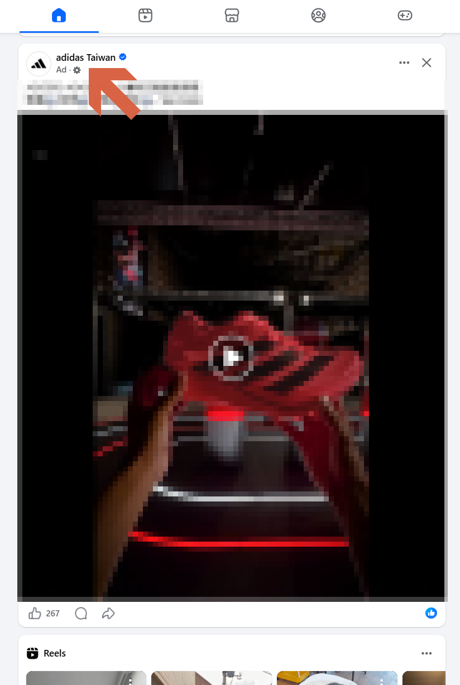
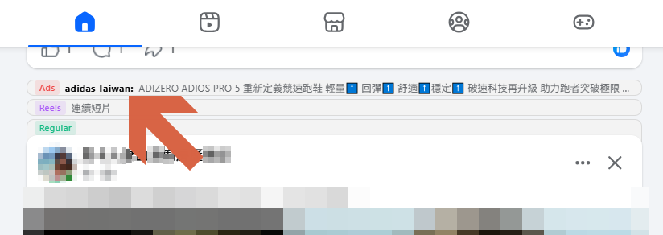
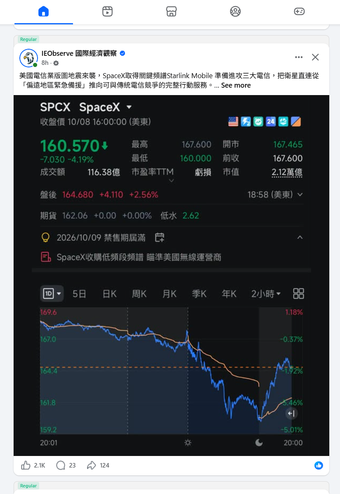
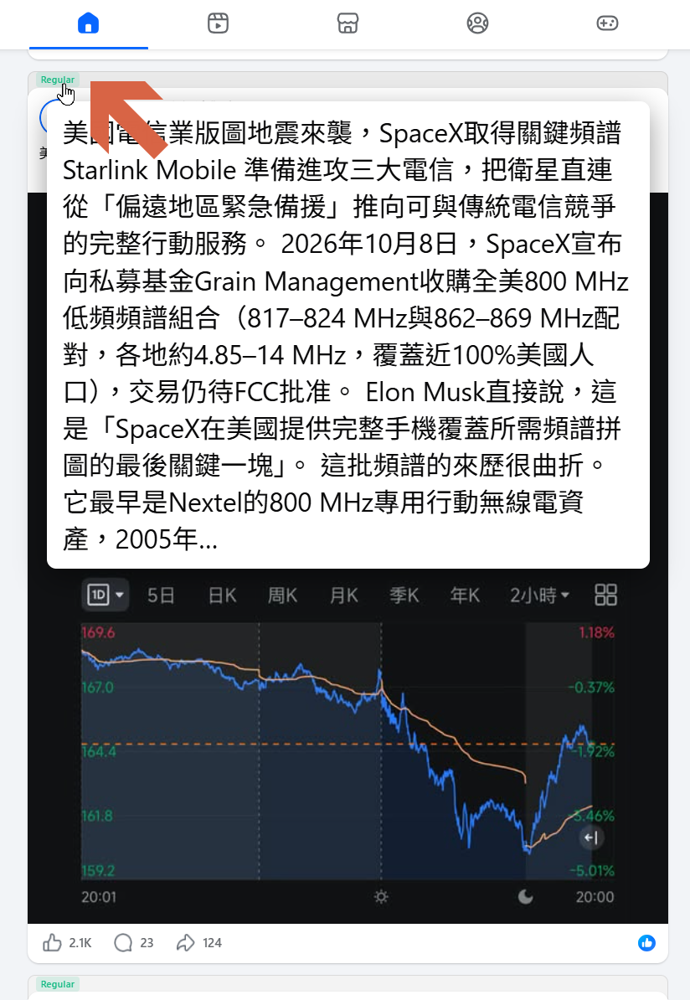
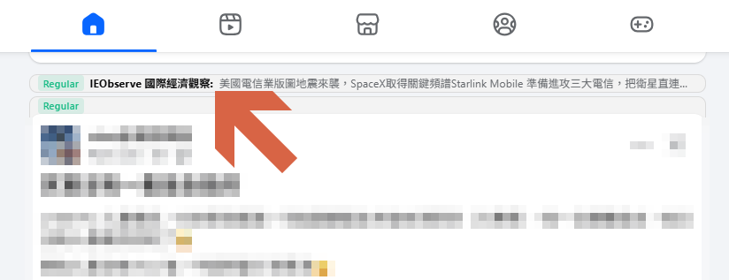
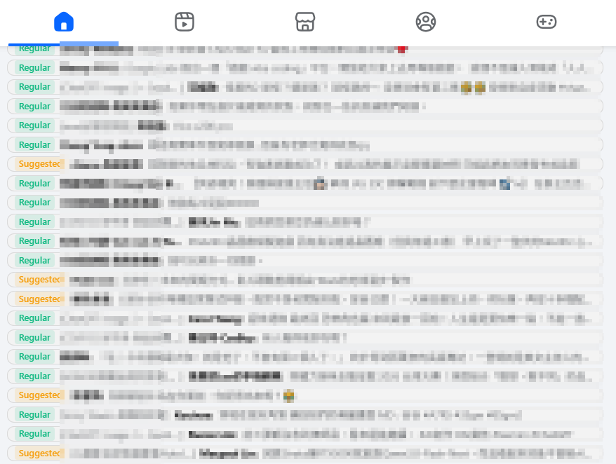
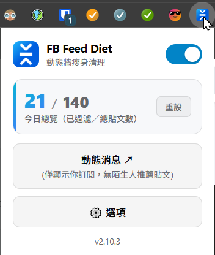
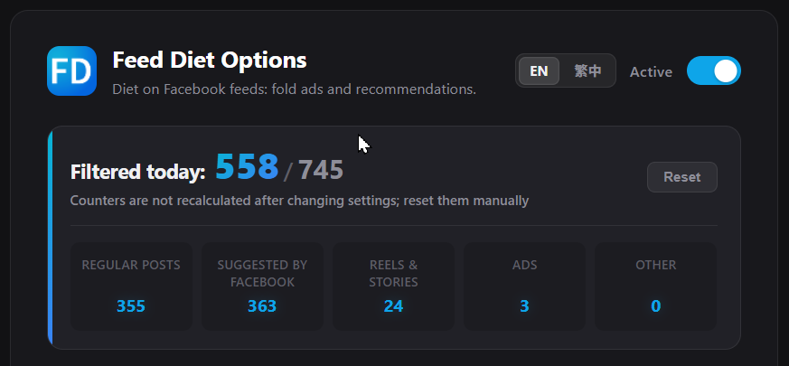
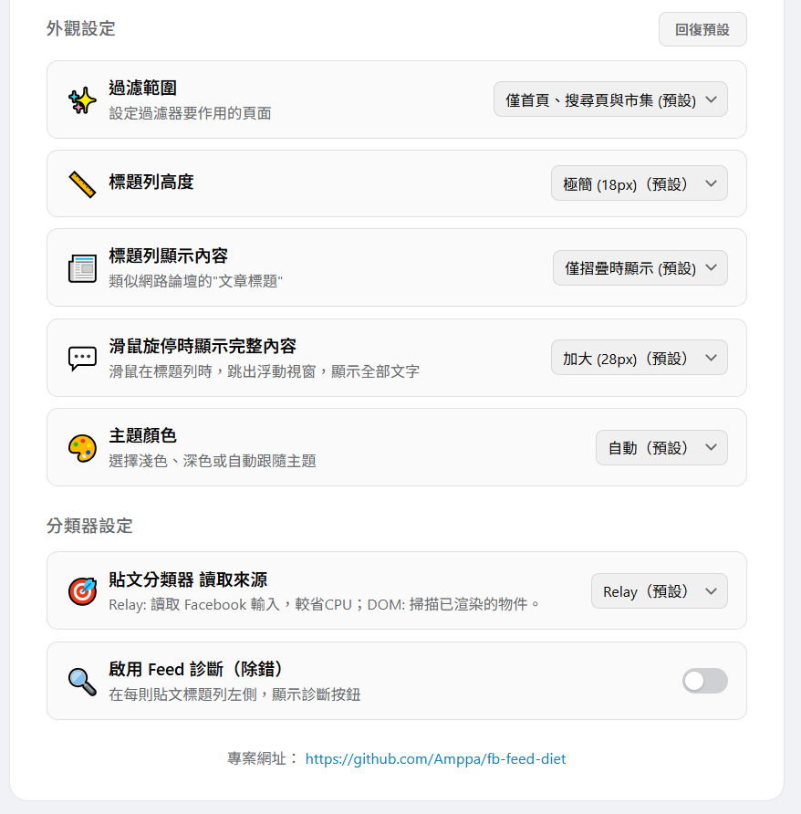

# FB Feed Diet － 臉書動態消息減肥器

[繁體中文](README.zh-TW.md) | [Español](README.es.md) | [English](README.md)

## 👉 直接下載 [release](https://github.com/Amppa/fb-feed-diet/releases)

FB Feed Diet 是一款用於 Facebook 的瀏覽器擴充功能，可隱藏動態消息中的贊助貼文、推薦內容、Reels 等項目，減少不需要的內容對閱讀的干擾。

被折疊的內容會以**標題列**取代，使用者可以隨時展開查看。你也可以依照自己的需求調整折疊規則與顯示方式。

## 預覽

<table>
  <thead>
    <tr>
      <th align="center">過濾前</th>
      <th align="center">過濾廣告與推薦後</th>
    </tr>
  </thead>
  <tbody>
    <tr valign="top">
      <td align="center" valign="top"></td>
      <td align="center" valign="top"></td>
    </tr>
  </tbody>
</table>

## 功能

### 標準模式（預設）

* **反廣告（贊助內容）**：折疊贊助貼文（Sponsored）、Marketplace 推薦內容及搜尋廣告。
* **反推薦（推薦貼文）**：折疊 Facebook 演算法推薦的貼文，例如「為你推薦」（Suggested for you）。
* **隱藏短影音（Reels 與限時動態）**：可設定是否折疊短影音與限時動態區塊。
* **統計**：判斷本日收到多少廣告、推薦與短影音數量。
* **懸停預覽**：將滑鼠移至標題列上，不用點開"閱讀全文"，就可以看完整貼文內容。
* **隨時展開與收合**：以標題列取代折疊內容，點擊即可還原貼文。

<table>
  <thead>
    <tr>
      <th align="center">一般貼文</th>
      <th align="center">懸停預覽</th>
      <th align="center">折疊狀態</th>
    </tr>
  </thead>
  <tbody>
    <tr valign="top">
      <td align="center" valign="top"></td>
      <td align="center" valign="top"></td>
      <td align="center" valign="top"></td>
    </tr>
  </tbody>
</table>

### 標題模式=討論區模式（Index-based）
* **自訂折疊規則**：如果你喜歡一眼掃過所有貼文，選擇有興趣的貼文展開，可以選擇此模式。
* **折疊外觀設定**：調整標題列高度等顯示選項，可以選擇 18px 或 36px（預設 18px）

## 安裝

### Google Chrome

#### 方式一：Chrome 商店

上架中，敬請期待。

#### 方式二：下載 Release 套件

1. 前往 [Releases](https://github.com/Amppa/fb-feed-diet/releases) 頁面，下載最新的 Chrome 版 ZIP 套件。
2. 將 ZIP 檔案解壓縮至本機資料夾，並保留該資料夾，以供瀏覽器載入。
3. 在 Chrome 網址列輸入 `chrome://extensions/`。
4. 開啟右上角的「開發人員模式」。
5. 點擊「載入未封裝項目」。
6. 選取解壓縮後的專案資料夾。
7. 開啟 [Facebook](https://www.facebook.com/)。

完成後，擴充功能便會在 Facebook 頁面上運作。

### Firefox（128 或更新版本）

目前可透過 Firefox 的暫時性附加元件功能載入。

1. 下載或複製本專案。
2. 在 Firefox 網址列輸入 `about:debugging#/setup/runtime/this-firefox`。
3. 點擊「暫時性載入附加元件…」。
4. 選取專案目錄中的 `manifest.json`。
5. 開啟 [Facebook](https://www.facebook.com/)。

> 注意：Firefox 的暫時性附加元件通常會在瀏覽器重新啟動後卸載，需要重新載入才能繼續使用。

## 使用方式

### 快速開關

點擊瀏覽器工具列上的 FB Feed Diet 圖示，即可開啟或關閉過濾功能，並查看目前的過濾統計。

### 調整設定

在擴充功能的彈出視窗中開啟「設定（Options）」：

* 五大類貼文的摺疊設定。
* 標題列高度、標題顯示內文、懸停顯示內文等設定。
* 英文、繁體中文、西班牙文介面切換；淺色、深色模式切換。
* 偵測模式（Relay 或 DOM）。

| 即時統計與分類設定 | 外觀與偵測模式 |
| :---: | :---: |
|  |  | 

## 隱私與權限

FB Feed Diet 的設計以本機處理為主。

* **零資料收集**：不收集、追蹤或傳輸任何使用者資料、瀏覽紀錄或貼文內容，無遙測、無後端伺服器、無外部連線。
* **本機儲存**：所有設定選項與過濾計數器均儲存在瀏覽器本機端（`chrome.storage.local`）。
* **最小必要權限**：
  * 主機權限（`*://*.facebook.com/*`）：僅用於在 Facebook 頁面上執行過濾邏輯。
  * `storage`：儲存本機設定與統計資料。
  * `scripting`：將設定即時同步至已開啟的 Facebook 分頁。
* **開源透明**：所有程式碼完全開源公開，安全可查驗。
* **隱私權政策**：詳細政策條款請參閱 [PRIVACY.md](PRIVACY.md)。

## 相容性與限制

* 支援 Firefox、Google Chrome、以及 Microsoft Edge 等基於 Chromium 的瀏覽器。
* Facebook 可能隨時調整頁面結構、貼文格式或內部資料，因此分類器在未來可能失效。
* 提供兩種分類器： **Relay**（直接讀取頁面原始資料）或 **DOM**（掃描頁面結構，較完整）模式。
* 遇到漏判或異常，歡迎到 [Issues](https://github.com/Amppa/fb-feed-diet/issues) 回報，請附上錯誤的 feed probe log。

## 致謝

本專案的開發受到以下專案啟發：

* [ESUIT | ADBlocker for Facebook](https://addons.mozilla.org/zh-TW/firefox/addon/esuit-ad-blocker-for-facebook/)
* [F.B. Sponsored/Ad Post Blocker](https://github.com/browseraddonsupport-wq/fb-sponsored-ad-post-blocker)

本專案採用不同的內容判斷路徑，以確保偵測的準確性。

## 授權

本專案採用 [MIT License](LICENSE)。
