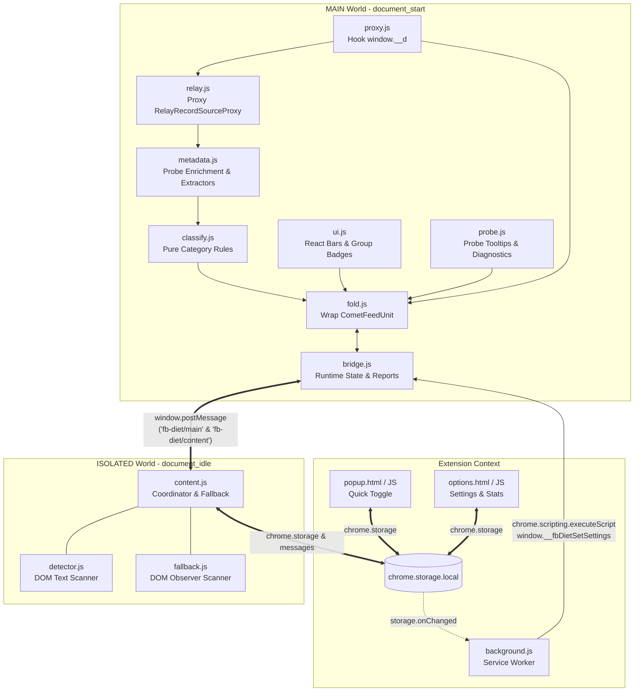

# Architecture, Modules & Runtime Flows

> Developer topic file. Start at the hub: [DEVELOPMENT.md](../DEVELOPMENT.md).

## 🏗️ High-Level Architecture

FB Diet utilizes a **Dual-World Architecture** under Chrome Manifest V3 to balance high-speed React-level interception with secure Chrome extension APIs:



### Core Design Principles

1. **Pure Object Patching (no eval, no CSP games)**: The MAIN-world modules only wrap live objects (module registrar, exported classes) — never `eval` / `new Function` / inline scripts, so the Facebook page CSP stays untouched and cannot interfere with page loading.
2. **Authoritative Relay Store Capture**: Wraps the exported class of `relay-runtime/mutations/RelayRecordSourceProxy` with a Proxy construct trap, so every Relay store instance is remembered without rewriting any module source. (The old `rules.json` CSP override + `RelayPublishQueue` source rewrite were removed in STRATEGY.md decision #9: the CSP replacement risked breaking page loads, and the construct trap captures the same store.)
3. **Non-Destructive React Tree (1x1 Squash)**: Feed units are never removed or destroyed. `fold.js` wraps the original component and applies a `1x1` squash container with `overflow: hidden`, ensuring Facebook video players and IntersectionObserver monitors stay stable.
4. **Dual Engine Modes (Proxy Mode vs DOM Mode)**: Users can toggle between high-speed MAIN world Proxy mode (default) and traditional ISOLATED world DOM mode in the Options page.
5. **Resilient Lifecycle (`shutdown`)**: To eliminate `Extension context invalidated` errors when developers reload the extension, open tabs safely disconnect `MutationObserver` instances, clear pending timers, and silence storage flushes.
6. **React 18 Safe Hydration Commit Gate**: To prevent `Minified React error #418` (Hydration Mismatch) in Facebook's streaming SSR / Selective Hydration architecture, all wrapped components (`FBDietFold`, `SideAdHidden`, `RightRailUnitWrapper`) return the unmodified server-rendered tree on initial render. Upon successful commit (before browser paint via `useLayoutEffect`), they transition seamlessly to the folded state, guaranteeing zero hydration errors, zero DOM destruction, and flicker-free visual performance.

---

## 🧩 Directory & Module Breakdown

### Shared Defaults Module (`src/shared/`)

- **`defaults.js` (`globalThis.FB_DIET_DEFAULTS`)**: Single source of truth for configuration, statistics, and multilingual keyword schemas.
  - Exposes `FB_DIET_DEFAULTS.SETTINGS` (including the fold-scope switch `restrictFoldScope` and the three-state fold bar title `showTitleMode`, default `whenFolded`), `FB_DIET_DEFAULTS.COUNTS`, the named `KEYWORDS` matrices, the user-facing group layer (`GROUP_BY_CATEGORY`, `SETTING_KEYS_BY_GROUP`, `GROUP_ORDER`; STRATEGY.md decision #8), the pure helpers `isFoldScopeAllowed(pathname)` (decision #26) and `normalizeTitleMode(value)` (decision #27), and `VERSION`.
  - Loaded before all scripts via `manifest.json` (`content_scripts`), `importScripts` (`background.js`), and `<script>` tags (`popup.html`, `options.html`).
  - Eliminates configuration and keyword drift across contexts.
- **`theme.css`**: Shared UI design tokens, universal resets, switches, badges, and card styles linked across extension pages (`options.html`, `popup.html`).

### Main World Modules (`src/inject/`)

Loaded sequentially at `document_start` before Comet finishes loading:

- **`proxy.js` (`window.FBDietProxy`)**:
  - Intercepts `window.__d` (Comet module definer) via property getter/setter.
  - Matches requested module names (e.g. `CometFeedUnitErrorBoundary.react`).
  - Wraps component factories without modifying source text.
  - Exposes `getReact()` and diagnostic getters.
- **`relay.js` (`window.FBDietRelay`)**:
  - Uses a `Proxy` `construct` trap around `relay-runtime/mutations/RelayRecordSourceProxy`.
  - Maintains an LRU cache of the latest 6 record store proxies (`sources`).
  - Implements path evaluator supporting syntax:
    - `^field`: follow linked record ID.
    - `^^list[0].field`: access first item in linked record list.
    - `{$1}` / `{$args}`: dynamic query variables.
    - `*`: wildcard record lookups.
- **`metadata.js` (`window.FBDietMetadata`)**:
  - Pure diagnostic enrichment and candidate record extractor.
  - Extracts author metadata (actor name, id, profile URL, subscribe status), group details (forum join state), post content (snippet, permalinks), media counts, and viewer self-check.
  - Exposes `extractCandidateRecords(roots)` to recursively walk React element trees, Context Providers, and fragment wrappers without throwing, shared directly with `classify.js`.
- **`classify.js` (`window.FBDietClassify`)**:
  - Pure deterministic classification functions.
  - Evaluates direct props first, followed by Relay paths.
  - `classifyFeedUnit(payload, context)` — `context.moduleName` is part of the decision (the Reels attachment wrapper never folds as Reels).
  - Supported categories (see [STRATEGY.md](../STRATEGY.md) for the full decision log):
    - `sponsored`: `^sponsored_data.ad_id`
    - `suggested`: `^^actors[0].subscribe_status === 'CAN_SUBSCRIBE'` (only this value) or `^to.viewer_forum_join_state === 'CAN_JOIN'` (a can-join group post is a suggestion; STRATEGY.md, decision #10). story_header is diagnostic-only evidence and NEVER decides a category (STRATEGY.md, decision #6).
    - `suggestedGroup`: `GroupsYouShouldJoinFeedUnit` / `GroupSuggestionsFeedUnit` typenames only — the horizontal "groups you should join" list unit (STRATEGY.md, decision #10)
    - `reels`: the unit's OWN `__typename === 'ShowcaseFeedUnit'` (nested attachment records and the attachment-style module are excluded on purpose)
    - `stories`: the unit's OWN `__typename === 'DiscoverFeedUnit'` (mid-feed Stories row; STRATEGY.md, decision #7); other Stories surfaces plus `marketAds` / `searchingAds` use component-name markers in `fold.js`, not unit classification
  - **User-facing groups** (two-layer model, STRATEGY.md decision #8): fine-grained categories map to 5 groups —
    `ads` (sponsored + marketAds + searchingAds), `regular` (no-match bucket; stats only, never foldable),
    `suggested`, `media` (reels + stories), `other` (suggestedGroup).
    Storage stays per-category with zero migration; Options group switches batch-write the mapped keys
    (`SETTING_KEYS_BY_GROUP`, "on" only when every mapped key is on). Folded bars and the stats breakdown
    display the group; probe popups show both layers (feed type + group).
    The Options page also provides a Minimized Fold Mode checkbox to switch between the 36px title bar mode (default) and the 18px ultra-slim mode.
- **`bridge.js` (`window.FBDietBridge`)**:
  - Owns in-page expand/collapse state (`expandedSet`).
  - Manages deduplication sets (`reportedBlockedSet`, `reportedRegularSet`) to prevent redundant storage writes.
  - Handles `window.postMessage` communication between MAIN and ISOLATED worlds.
  - Accepts immediate settings push via `window.__fbDietSetSettings`.
- **`dom-suggested.js` (`window.FBDietDOMSuggested`)**:
  - MAIN-world Full Mode suggested-post detector for rendered DOM, including action buttons, recommendation headers, reshare exclusions, and verified/menu/privacy guards.
  - Uses the named `FB_DIET_DEFAULTS.KEYWORDS` matrices and remains separate from the ISOLATED-world `detector.js`.
- **`ui.js` (`window.FBDietUI`, `window.FBDietDOMMetadata`)**:
  - React UI components and group badges for placeholder bars.
  - Embeds mounted-DOM metadata extraction (`window.FBDietDOMMetadata`) directly to eliminate multi-script injection ordering and reload desync risks.
  - `FBDietDOMMetadata.collect(container, isMediaGroup, relayContext)` synthesizes a permalink for units whose DOM has neither a permalink nor a timestamp link: `relayContext.postId` comes from Relay (never guessed from the DOM), and the author handle — plus the group id for group posts — is proven by the author profile link. A stray group link in the container is not sufficient evidence for group permalink synthesis.
  - Provides `FBDietTitleBar` (36px default / 18px mini modes, streaming Suspense observer, and expand/collapse control).
  - Reshare detection (`extractReshareFromDom`) applies a structural pre-filter before comparing author names: candidates inside the probe UI or a comment section are skipped, and a candidate that wraps (or sits inside) the unit's own header is the unit itself, not a quoted original post.
- **`probe.js` (`window.FBDietProbe`)**:
  - Diagnostic JSON generator and developer inspection layer.
  - Discovers heuristic signals (keywords, sponsored markers, author names) and generates formatted reports (`formatProbeReport`).
  - Implements the in-page probe popup, copy-to-clipboard interactions, and tooltip rendering for debugging live feeds.
- **`fold.js` (`window.FBDietFold`)**:
  - Wraps target feed unit components using `React.createElement`.
  - Folded bars and re-fold bars show the user-facing GROUP badge resolved by `ui.js` (`GROUP_META` + `GROUP_BY_CATEGORY` via `groupOf(category)`), not the fine-grained category (STRATEGY.md, decision #8).
  - Enforces strict Rules of Hooks (unconditional top-level hooks: `useContext`, `useState`, `useEffect`, `useSafeLayoutEffect`).
  - **Safe Hydration Commit Gate**: Returns the original `rendered` tree during initial SSR hydration pass, then transitions to folded UI via `useSafeLayoutEffect` immediately upon commit, eliminating React 18 `#418` hydration mismatch errors.
  - If a unit matches an active filter and is not expanded, renders an inline `FBDietFold` bar and sets the original element container to squash mode (`1x1` container).
  - **Fold scope guard** (STRATEGY.md, decision #26): after the unconditional hooks and the enabled/mode checks, `settings.restrictFoldScope !== false` plus `FB_DIET_DEFAULTS.isFoldScopeAllowed(location.pathname)` decide whether classification runs. Out-of-scope units (e.g. `/groups/...`) return the untouched tree with a null-classify probe — zero classification, zero counters, zero `fbDietLog` entries, no fold bar. Fails open when the defaults module or the pathname is unavailable.
  - Also guards sidebar ad units (`SideAdHidden` and `RightRailUnitWrapper`) with identical commit gates. `SideAdHidden` is a pure visual hide that works on every page (independent of `restrictFoldScope`) and posts no counters (decision #26).
  - **Right rail pre-hydration suppression**: `install()` injects a `<style>` element at `document_start` hiding right rail ad units via browser privacy/ad attributes (`a[attributionsrc]`, `a[target^="rhcad"]`, `a[href*="fbclid="]`, `a[href*="/l.php"]`) scoped within the sidebar landmark (`div[role="complementary"]`, `aside`, `[data-pagelet*="RightRail"]`). This eliminates the SSR hydration gap flicker (first-frame suppression) while preserving React 18 hydration stability, with post-hydration `.fb-diet-side-ad-hidden` classes acting as authority.
  - **Three-state fold bar title** (STRATEGY.md, decision #27): `resolveShowTitle(settings, !isFolded)` maps `showTitleMode` (`always` / `whenFolded` / `never`, default `whenFolded`) onto the per-state `showTitle` prop. `showTitleMode` is the only source — the legacy `showFeedTitle` boolean was removed (decision #28) and an unknown or missing value falls back to the schema default. `whenFolded` shows the title while the post is folded (a summary of the hidden content) and hides it once expanded; metadata collection follows the same value, so expanded bars under `whenFolded` skip `FBDietMetadata.collect()`.
  - Tracks diagnostic hydration statistics (`getStatus().hydration`).
  - Preserves Relay query subscriptions and React component identity.

### Isolated World Modules (`src/content/`)

- **`content.js`**:
  - Listens for `fb-diet/main` messages (`ready`, `blocked`, `allowed`, `regular`).
  - Persists a capped diagnostic log of classification events to `chrome.storage.local` (`fbDietLog`, last 300 entries, batched flush).
  - Manages a 3-second throttled buffer (`countBuffer`) to batch-update `chrome.storage.local`.
  - Disables DOM scanning as soon as `ready` is received from MAIN world.
  - Implements `shutdown()`: called on context invalidation to gracefully halt observers and timers.
- **`detector.js` (`window.FBDietDetector`)**:
  - Fallback text parser using the shared `FB_DIET_DEFAULTS.KEYWORDS` matrices (Sponsored, Suggested, etc.).
  - Handles SVG text masking, aria-labels, and obfuscated spans.
- **`fallback.js` (`window.FBDietDOMFallback`)**:
  - DOM fallback scanner used when the MAIN world proxy never reports in (STRATEGY.md, decision #26).
  - `scanPage` honours `restrictFoldScope` with a `wasInFoldScope` transition flag: the scan runs only inside the allowlist; leaving the scope restores all folded elements once and clears stale `data-fb-diet-fingerprint` values (so recycled SPA nodes can re-fold); while out of scope each scan costs a single pathname comparison.

### Background Service Worker (`src/background/`)

- **`background.js`**:
  - Operates as Chrome Manifest V3 Service Worker.
  - Manages initial default settings and daily count resets upon extension install or update.
  - Listens to `chrome.storage.onChanged` and authoritatively pushes updated settings to open Facebook tabs via `chrome.scripting.executeScript` targeting `window.__fbDietSetSettings` in the `MAIN` world.
  - Re-injects settings upon tab reload/navigation events.
  - Follows zero-backward-compatibility during rapid development: always merges cleanly with `DEFAULT_SETTINGS` without legacy schema translation overhead.

### Shared i18n Module (`src/i18n/`)

- **`i18n.js` (`window.FBDietI18N`)**: Dependency-free dictionary module shared by the pages that render UI text.
  - Loaded via `<script>` from `src/options/options.html` and `src/popup/popup.html`. It is intentionally NOT in
    `manifest.json`'s content-script lists, so neither the ISOLATED content scripts nor the MAIN world have it.
  - Ships `en` and `zh-TW`; every other locale normalizes to `en` (`normalize`, `detect`, `FALLBACK`).
  - API: `t(key, lang?)`, `detect()`, `getLang()`, `setLang(code)`, `normalize(code)`, `LOCALES`, `FALLBACK`.
  - `t()` resolves the requested language, then English, then returns the key itself, so an unknown key is
    visible instead of blank. Options/popup drive DOM text through `data-i18n` / `data-i18n-title` attributes.
  - Feed placeholder badges stay hardcoded in `fold.js` (`GROUP_META.badgeText`, one per user-facing group) on purpose: the MAIN world
    has no i18n module (`tests/i18n.test.js` asserts the badge keys were trimmed from the shared dictionary).

---

## 🔄 Runtime Data & Control Flows

### 1. Initialization Sequence

```text
Tab Navigates to facebook.com
  │
  ├─► [MAIN World: document_start]
  │     1. defaults.js sets global FB_DIET_DEFAULTS schemas & keyword matrices
  │     2. proxy.js attaches getter/setter to window.__d
  │     3. relay.js queues wrapExports for RelayRecordSourceProxy
  │     4. metadata.js exposes diagnostic enrichment & candidate extractors
  │     5. classify.js binds setRelayReader & pure decision rules
  │     6. bridge.js registers postMessage listener & in-memory state
  │     7. dom-suggested.js exposes Full Mode suggested detection
  │     8. ui.js embeds DOM metadata extraction (FBDietDOMMetadata) & loads title bars
  │     9. probe.js prepares diagnostic reports and copy popup
  │     10. fold.js registers CometFeedUnitErrorBoundary.react with proxy
  │
  ├─► [Background Service Worker]
  │     Pushes saved settings to tab via chrome.scripting (window.__fbDietSetSettings)
  │
  └─► [ISOLATED World: document_idle]
        1. content.js boots, reads settings, and announces the current settings to MAIN
        2. Sends ping { source: 'fb-diet/content', type: 'ping' }
        3. MAIN world replies ready { source: 'fb-diet/main', type: 'ready' }
        4. content.js marks proxyActive = true
```

### 2. Feed Unit Classification & Folding Flow

```text
Comet renders CometFeedUnitErrorBoundary
  │
  ▼
FBDietFold wrapper executes
  │
  ├─► Extract feed unit ID & props
  ├─► Check bridge.isExpanded(unitId)
  │     └─► If true: return original component untouched
  │
  ├─► FBDietClassify.classifyFeedUnit(payload)
  │     ├─► Inspect props directly
  │     └─► Read Relay paths via FBDietRelay.read(...)
  │
  ├─► Matched active category?
  │     ├─► NO:
  │     │     Report regular (reason: no-match) -> return original element
  │     │
  │     └─► YES:
  │           1. bridge.reportBlocked(unitId, category)
  │           2. postMessage to content.js (queued for 3s storage flush)
  │           3. Return placeholder bar + hidden original tree (display: none)
```

### 3. Expand / Restore Lifecycle

When a user clicks **"Expand"** on a folded placeholder:
1. `fold.js` event handler calls `bridge.toggleExpanded(unitId, true)`.
2. Component triggers local React state rerender (`setExpanded(true)`).
3. The original tree becomes visible immediately with a **"Re-fold"** option on top.
4. The expanded state is kept in memory (`bridge.js`) keyed by `unitId`, surviving virtual scroll recycling without hitting disk storage.
