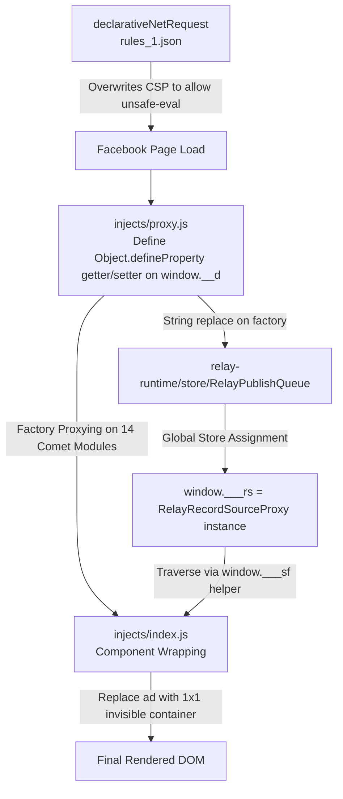

# ESUIT Facebook Suggest Blocker — Architectural Teardown & Reverse Engineering

- **Project**: `esuit-suggest-blocker` (Chrome Extension ID: `jkbklfkombochacjoeagggbiohipcbaj`)
- **Analyzed Version**: `v2.10.0`
- **Source Artifact**: CRX unpacked / Web Store distribution

---

## 1. Overview

`esuit-suggest-blocker` is a Chrome extension designed to filter Facebook feed recommendations and ads. It represents an early pioneer in extracting classification signals directly from Facebook's client-side Relay Store in the `MAIN` execution world, rather than parsing fragile DOM text.

---

## 2. Architecture & Hooking Mechanism



### 1. CSP Relaxation & Code Injection
- **Technique**: Uses MV3 `declarativeNetRequest` with `rules_1.json` to overwrite Facebook's response `content-security-policy` header with a static header containing `'unsafe-eval'` and `'unsafe-inline'`.
- **Loader Interception**: Defines a `getter/setter` on `window.__d` before Facebook's loader initializes, wrapping `window.__d` with a `Proxy`.
- **Store Capture via String Manipulation**:
  Performs regex string substitution on the `RelayPublishQueue` module factory:
  ```javascript
  sourceCode.replace(
    /,(\w+)=new\((\w+)\("relay-runtime\/mutations\/RelayRecordSourceProxy"/,
    ',$1=window["___rs"]=new($2("relay-runtime/mutations/RelayRecordSourceProxy"'
  );
  ```
  The modified code string is re-compiled into an executable function via dynamic `<script>` tag injection (`window['__fnCache']`).
- **Relay Read Helper**: Exposes `window.___sf(id, path)` to traverse records and follow pointers (paths with `^` and `^^` prefixes).

### 2. Operational Scope
- Only runs when `location.pathname === '/'` (Strictly limited to the homepage root). Unhandled on search, marketplace, or permalink routes.

---

## 3. Feed Classification Logic (`classifyFeedUnit`)

esuit extracts the root Relay unit ID and evaluates short-circuiting conditions in fixed order:

```text
Groups You Might Like  -->  Suggested  -->  Sponsored  -->  Reels / Story Header
```

### Decision Rules Table

| Target Category | Condition / Heuristic | Evaluated Path in Relay Store (`window.___sf`) |
| :--- | :--- | :--- |
| **GROUP_YOU_MIGHT_LIKE** | `unitTypename ∈ ['GroupsYouShouldJoinFeedUnit']` | Direct typename of unit |
| **SUGGESTED** | `subscribe_status === 'CAN_SUBSCRIBE'`<br>or `viewer_forum_join_state === 'CAN_JOIN'` | `^^actors[0].subscribe_status`<br>`^to.viewer_forum_join_state` |
| **SPONSORED** | `sponsored_data.ad_id` exists | `^sponsored_data.ad_id` |
| **REELS** | Nested unit has `showcase_story_type === 'SHOWCASE_SHORT_VIDEO'` | Nested unit path |
| **SUGGESTED** *(Header variant)* | `title.text` exists under `story_header{"location":"homepage_stream"}` | Nested unit `story_header` |

### Non-Feed Component Decoration
Apart from `classifyFeedUnit`, esuit wraps 14 fixed Comet component names via `window.__d`:
- Stories trays (`StoriesTray*.react`, `CometStoriesTray.react`)
- Marketplace side units (`CometMarketplaceAdCard.react`)
- Search ads (`SearchCometResultsAd.react`)
- Right rail units (`CometHomeRightRailUnit.react`, `CometAdsSideFeedUnitItem.react`)
- People You May Know grids (`FriendingCometPYMK*.react`)

### 1x1 Squash Container
To avoid triggering Facebook's internal `IntersectionObserver` exceptions when `display: none` is applied to active feed items, esuit encapsulates filtered units in a 1x1 invisible container:
```javascript
function renderHidden(child) {
  return t.jsx("div", {
    style: { position: "relative" },
    children: t.jsx("div", {
      style: {
        position: "absolute",
        left: 0,
        top: 0,
        opacity: 0,
        pointerEvents: "none",
        userSelect: "none",
        zIndex: -1,
        maxWidth: 1,
        maxHeight: 1,
        width: 1,
        height: 1,
        overflow: "hidden"
      },
      children: child
    })
  });
}
```

---

## 4. Architecture Evaluation & Vulnerabilities

### Critical Vulnerabilities & Flaws

#### 1. Page Instability from Static CSP Overwrite
- **Problem**: Overwriting Facebook's dynamic CSP with a static domain whitelist breaks whenever Meta provisions new CDN origins (`*.fbcdn.net`, regional media clusters).
- **Consequence**: Users suffer intermittent white screens and failed resource fetches due to browser-level CSP rejections.
- **Architectural Risk**: Violates Chrome Web Store security guidelines by re-introducing `'unsafe-eval'`.

#### 2. False Positives: Contextual Story Header Collision
- **Problem**: Checks if `story_header(location:homepage_stream)` contains a non-empty `title.text`.
- **Failure Mode**: Facebook reuses the exact same keyed record (`client:*:story_header(location:homepage_stream):title`) for contextual organic friend stories (e.g., *"Alice commented on Bob's photo"*).
- **Consequence**: Genuine interactions between friends are misclassified as algorithmic suggestions and hidden.

#### 3. False Positives: Shared Reels
- **Problem**: Checks if any attachment unit carries `showcase_story_type === 'SHOWCASE_SHORT_VIDEO'`.
- **Failure Mode**: When a friend reshares an organic video Reel as an attachment inside a standard `Story`, the attachment record matches this criteria.
- **Consequence**: Friends' organic posts containing shared reels are aggressively hidden.

#### 4. Scope Limitations
- Bound strictly to `pathname === '/'`. Any SPA navigation to search or sub-feeds leaves ads unfiltered.
