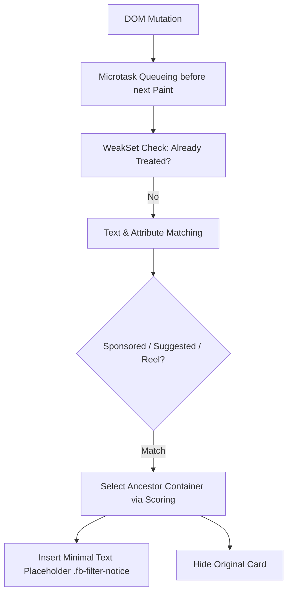

# Facebook Feed Filter — Architectural Teardown & Reverse Engineering

- **Project**: `Facebook Feed Filter` (Author: Mowd, Repository: `Mowd/facebook-feed-filter`)
- **Analyzed Version**: `v1.1.0`
- **Source Artifact**: GitHub repository source / Firefox Add-on / Chrome MV3 build

---

## 1. Architecture Overview

`Facebook Feed Filter` is a cross-browser extension (Firefox MV2 source compiled to Chrome MV3) focused on cleaning recommendations, sponsored posts, and Reels from the Facebook homepage (`/`).

### Cross-Browser Architecture
- `manifest.json`: Canonical Firefox Manifest V2.
- `scripts/build-manifest.mjs`: Node build script generating Chrome Manifest V3 with declarative rules.
- `extension-api.js`: Cross-browser adapter normalizing Promise-based (Firefox) and callback-based (Chrome) storage/i18n APIs.
- `content.js`: Core filtering engine running in standard `ISOLATED` world.

---

## 2. Core Filtering Mechanisms



### 1. Pre-Paint CSS Guard (`styles.css`)
To prevent visual pop-in (hydration flash) while JavaScript calculates container boundaries, CSS `:has()` rules immediately suppress high-confidence units:
```css
@supports selector(:has(*)) {
  html[data-fb-feed-filter-active="true"] [role="main"] [role="feed"] > *:has(
    [attributionsrc*="/privacy_sandbox/comet/register/source/"]
  ),
  html[data-fb-feed-filter-active="true"] [role="main"] [role="feed"] > *:has([data-ad-rendering-role^="cta"]),
  html[data-fb-feed-filter-active="true"] [role="main"] [role="feed"] > *:has([role="region"][aria-label="Reel" i]) {
    display: none !important;
  }
}
```

### 2. Microtask-Driven Mutation Processing
Instead of running heavy DOM queries on every observer callback, mutations are scheduled in microtasks:
- **Batching**: Groups DOM mutations occurring within the same tick.
- **WeakSet Tracking**: Maintains a `WeakSet` of processed element references, ensuring nodes are never re-evaluated across subsequent scroll passes.
- **Timing**: Pairs `queueMicrotask` with `requestAnimationFrame` to time placeholder insertions immediately before browser paint operations.

### 3. Container Scoring & Placeholder Insertion
Rather than deleting the DOM node (`el.remove()`), the extension replaces the card with an unobtrusive gray notice (`.fb-filter-notice`):
- Computes structural depth of ancestor nodes to ensure the entire outer card (including headers and engagement bars) is hidden without taking down parent feed wrappers.
- The placeholder renders localized text (e.g. *"Filtered sponsored post"* or *"已過濾贊助內容"*) across 8 languages.

---

## 3. Architecture Evaluation & Trade-offs

### Strengths
- **Clean Fallback UX**: Inserting discreet text placeholders prevents abrupt feed jumping and gives users visibility into filtered content.
- **Strict Homepage Route Scoping**: Automatically disables when navigating to groups, profiles, or search pages, preventing collateral damage outside the main feed.
- **Microtask Efficiency**: Batched DOM passes prevent mutation observer cascades and reflow storms.

### Limitations
- **Vulnerability to Advanced Scrambling**: Lacks Flexbox `order` reconstruction or SVG symbol stitching; when Facebook renders ads exclusively as vector symbols without accessible text or `attributionsrc`, detection degrades.
- **CSS Selector Reliance**: The pre-paint CSS guards rely on `:has()`, which depends on Facebook retaining identifiable attribution endpoints.
