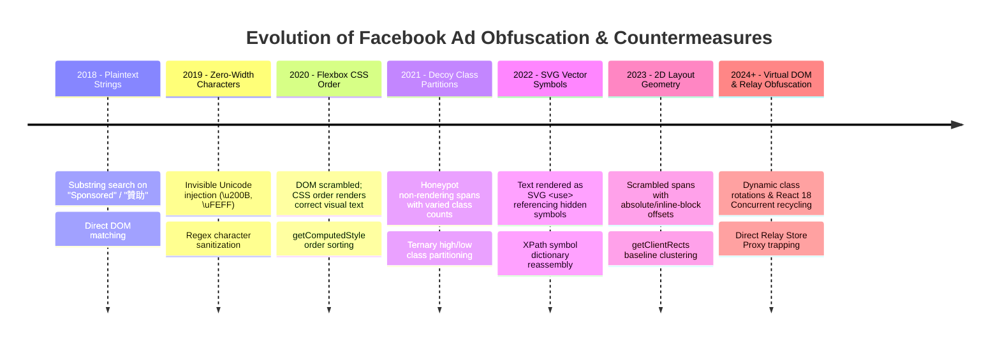

# Cross-Project Algorithmic Feasibility Analysis & Synthesis

This document provides a comparative synthesis of the 8 reference ad-blocking and feed-filtering projects reverse-engineered in `docs/research/`. It evaluates the technical viability, performance impact, and failure modes of each major filtering algorithm.

---

## 1. Architectural Taxonomy of Web Filtering

Across the 8 analyzed projects, web filtering strategies divide into four distinct architectural paradigms:

```text
┌────────────────────────────────────────────────────────────────────────┐
│ 1. Data-Layer / Memory Hooks (MAIN World)                              │
│    Intercept Relay Store / GraphQL props before DOM is constructed.    │
│    Examples: esuit-suggest-blocker                                     │
├────────────────────────────────────────────────────────────────────────┤
│ 2. Heuristic DOM & Layout Reconstruction (ISOLATED / Userscript)       │
│    Reverse-engineers visual layout (Flex order, 2D rects, SVG symbols).│
│    Examples: BlockZilla, F.B. Sponsored Blocker, Web Cleaner          │
├────────────────────────────────────────────────────────────────────────┤
│ 3. Pre-Paint CSS Guards & Viewport Schedulers                          │
│    Uses CSS :has() + IntersectionObserver to minimize flash and CPU.   │
│    Examples: Feed Filter for FB (fff), Facebook Feed Filter (Mowd)     │
├────────────────────────────────────────────────────────────────────────┤
│ 4. Naive Substring & Direct DOM Pruning (Anti-Pattern)                 │
│    Text inclusion matching + el.remove().                              │
│    Examples: Social Sponsored Ads Blocker                              │
└────────────────────────────────────────────────────────────────────────┘
```

---

## 2. Comparative Algorithmic Matrix

| Algorithm / Mechanism | Reference Project | Primary Strength | Critical Vulnerability / Trade-off | Feasibility Rating |
| :--- | :--- | :--- | :--- | :--- |
| **Relay Store Hook via Factory Replacement** | `esuit` (v2.10.0) | Direct memory access (`ad_id`, `CAN_SUBSCRIBE`), 100% immune to DOM obfuscation | Overwrites CSP with `unsafe-eval`; fragile regex string replace on runtime bundle | **High Potential, Needs Clean Hook** (e.g. Proxy trap without CSP override) |
| **XPath SVG Symbol Map Assembly** | `BlockZilla` (v2.6.0) | Overcomes vector-drawn SVG ad labels by reassembling `<use>` references | High CPU overhead on scroll; brittle to SVG ID prefix renames (`#Svg`, `#gid`) | **Medium** (Valuable as secondary DOM fallback) |
| **2D Geometry Coordinate Sorting (`getClientRects`)** | `Web Cleaner` (v8.22.0) | Groups letters on horizontal baseline; immune to flex order and DOM tree scrambling | Forces browser layout reflow; requires strict viewport bounding gates | **Medium** (Clever, but style flushes are costly) |
| **Flexbox `order` Sorting + Decoy Partitioning** | `F.B. Sponsored` (v1.1.76) | Bypasses character-split decoy spans without guessing class-direction flips | Requires O(1) `isCharacterSplit` gate; fails on SVG vector art without text | **High** (Standard baseline for scrambled text) |
| **Pre-paint CSS `:has()` Guards** | `fff` (v1.6.2), `Mowd` (v1.1.0) | Zero-flash suppression before React hydration completes | Brittle to attribute rotation (`attributionsrc`, `cta`); `:has()` has slight style calc cost | **High** (Excellent for perceptual visual polish) |
| **Consecutive-Hit Emergency Circuit Breaker** | `BlockZilla` (v2.6.0) | Halts filtering if 3 consecutive posts match; prevents blanking entire feed on FB updates | Leaves ads visible during failure mode (by design) | **Very High** (Essential safety property for any feed blocker) |
| **Author-Level Heading Boundary Check** | `F.B. Sponsored` (v1.1.76) | Eliminates false positives on friends resharing posts from unfollowed pages | Requires DOM traversal to identify primary card header | **Very High** (Mandatory for any Follow/Join heuristic) |
| **Messenger Contacts Regex Whitelist** | `fff` (v1.6.2) | Protects right-rail chat drawers and group chats from collateral damage | Requires maintaining multi-language keywords | **High** (Essential if extending scope to right rail) |
| **Raw `outerHTML.includes()` + `el.remove()`** | `Social Sponsored` (v4.0.10) | Minimal code footprint (70 lines) | Catastrophic false positives on organic text; breaks React Virtual DOM, causing white screens | **Rejected (Anti-Pattern)** |

---

## 3. Deep Algorithmic Evaluations

### A. Data-Layer Interception vs. DOM Parsing
- **Analysis**: DOM-based detection is an endless cat-and-mouse game against Facebook's anti-scraping obfuscations (character splitting, Unicode injection, Flexbox `order`, SVG `<use>`, dynamic ID rotation).
- **Finding**: Intercepting the underlying data graph (Relay Record Store) completely bypasses all DOM-level defenses. However, doing so must avoid `esuit`'s fatal flaw: **never relax the browser's Content Security Policy (CSP)**. Using native Proxy construct traps on Relay constructors achieves memory access without security compromises.

### B. Anti-Obfuscation: SVG Symbol Stitching vs. 2D Coordinate Sorting
- **SVG Symbol Stitching (`BlockZilla`)**:
  - Operates by indexing `<symbol id^="Svg">` elements and following `<use xlink:href>` links.
  - **Verdict**: Effective when ads use SVG vector symbols, but vulnerable to ID attribute rotation.
- **2D Geometry Sorting (`Web Cleaner`)**:
  - Groups individual character bounding boxes by Y-coordinate (within 3px tolerance) and sorts by X-coordinate.
  - **Verdict**: Elegant and layout-agnostic, but calls to `getClientRects()` on unthrottled mutations trigger expensive layout reflows.

### C. False Positive Prevention & Safety Patterns
1. **The Circuit Breaker**: `BlockZilla`'s 3-consecutive-ad threshold reflects a profound architectural insight: *feeds are never 100% ads*. An ad-blocker's failure mode must always fail-open (show ads) rather than fail-closed (destroy organic feed).
2. **Heading Scoping**: `F.B. Sponsored`'s rule requiring Follow/Join buttons to reside within the card's first heading (`isAuthorLevelLabel`) is the single most effective rule to prevent misclassifying reshared group content.
3. **The Poisonous Role**: Both `F.B. Sponsored` and live measurements confirm that `data-ad-rendering-role` is shared by organic Comet story templates. Any algorithm relying on it as a primary ad marker produces severe false positives.

---

## 4. Summary of Viable vs. Discarded Concepts

### Highly Viable Architectural Patterns
1. **Safe Relay Store Proxy Trapping**: Non-invasive capture of client-side GraphQL store.
2. **Author-Level Heading Bounding**: Restricting relationship checks strictly to top-level post headers.
3. **Emergency Circuit Breaker**: Automatic shutdown when consecutive match thresholds are exceeded.
4. **Pre-Paint CSS `:has()` Masks**: Zero-flash aesthetic guards for confirmed ad signatures.
5. **Contacts Heading Protection**: Multi-lingual regex whitelisting for right-rail drawers.

### Strictly Discarded Anti-Patterns
1. **Native Node Removal (`el.remove()`)**: Violates React 18 Concurrent virtual DOM invariants; causes unhandled exceptions and blank screen crashes.
2. **Unanchored Substring Scanning (`outerHTML.includes()`)**: Misclassifies any organic post mentioning ad keywords.
3. **Static CSP Overwrites (`declarativeNetRequest` header manipulation)**: Introduces fatal white screens when remote CDN clusters rotate.
4. **Unscoped `data-ad-*` Attributes**: Keying off story template roles kills organic group posts.

---

## 5. Facebook DOM Attributes & Selectors Risk Matrix

Every DOM selector or attribute carries distinct resilience, performance, and false-positive characteristics:

| Selector / Attribute | Primary Use Case | False Positive Risk | Resilience to Meta Updates | Recommendation & Usage Constraints |
| :--- | :--- | :--- | :--- | :--- |
| `[attributionsrc*="/privacy_sandbox/comet/register/source/"]` | Pre-paint CSS mask (`:has()`) | **Near Zero** | **Medium** | Safe for immediate visual hiding; breaks if user disables Privacy Sandbox or endpoint path changes. |
| `[aria-posinset]` | Feed post root container anchor | **Very Low** | **High** | Essential for virtualized feed boundary scoping; stable because accessibility tree requires it. |
| `[data-ad-rendering-role]` | Ad card detection | **Extremely High (POISONOUS)** | **Low** | **Do Not Use as Primary Filter**. Organic Comet group posts and marketplace items share the same message template. |
| `[data-ad-rendering-role^="cta"]` | Call-to-action button detection | **Low–Medium** | **Medium** | Viable only when combined with card-level boundary constraints; some organic events also carry CTA roles. |
| `svg use[*|href^="#Svg"]` / `#gid` | SVG symbol label reconstruction | **Low** | **Low–Medium** | Effective against vector text, but vulnerable to symbol prefix rotation. Requires runtime fallback. |
| `a[href*="/ads/"]` | Marketplace sponsored item detection | **Low** | **Medium** | Highly accurate for Marketplace cards; must climb parent tree carefully to avoid hiding grid containers. |
| `/stories/<id>/` permalink | Organic post verification | **High (TRAP)** | **Low** | **Do Not Treat as Organic Whitelist**. Sponsored ads frequently embed `/stories/` permalinks. |
| `[role="complementary"]` | Right sidebar ad panel filtering | **High (without whitelist)** | **High** | Dangerous unless paired with strict whitelist for Messenger contacts (`CONTACTS_HEADING_RE`). |
| Computed `order` on leaf spans | Flexbox de-scrambling | **Very Low** | **High** | Layout-agnostic; must be gated by `isCharacterSplit()` (4–120 children) to avoid layout reflow storms. |
| Computed 2D rects (`getClientRects()`) | Geometry baseline de-scrambling | **Very Low** | **Very High** | Immune to all DOM/CSS tree scrambling; must be gated by viewport bounds to avoid main-thread jank. |

---

## 6. Chronological Evolution of Facebook Ad Obfuscation

Understanding Meta's historical arms race reveals where obfuscation techniques are headed:



### Phase Details

1. **Phase 1: Plaintext Strings (`Sponsored`, `贊助`)**
   - *Mechanic*: Standard text inside anchor or span.
   - *Countermeasure*: Elementary text search (`node.textContent.includes('Sponsored')`). Defeated ~2018.

2. **Phase 2: Split Spans & Invisible Unicode Insertion**
   - *Mechanic*: Spans split per character (`<span>S</span><span>p</span>`), interleaved with zero-width spaces (`\u200B`, `\u200C`, `\u200D`, `\uFEFF`).
   - *Countermeasure*: Stripping non-printable characters via regex before matching.

3. **Phase 3: Flexbox CSS `order` Shuffling**
   - *Mechanic*: DOM order is scrambled (e.g., character 4 placed first), but visual presentation is corrected via CSS flexbox `order: 1`, `order: 2`.
   - *Countermeasure*: Extracting child leaf spans and sorting by `parseInt(getComputedStyle(span).order)`.

4. **Phase 4: Decoy & Honeypot Character Partitioning**
   - *Mechanic*: Random decoy characters injected into the DOM tree. Meta periodically alternates between giving decoys high class counts vs. low class counts to break simple filters.
   - *Countermeasure*: Ternary partitioning (`assemble(all)`, `assemble(high)`, `assemble(low)`) as developed in `F.B. Sponsored Blocker`.

5. **Phase 5: SVG Symbol Vector Stitching**
   - *Mechanic*: Replacing text nodes with `<svg><use xlink:href="#SvgId"></use></svg>`, rendering characters via reusable vector glyphs.
   - *Countermeasure*: XPath dynamic queries mapping `<symbol>` definitions to character lookup dictionaries (pioneered by `BlockZilla`).

6. **Phase 6: Geometric 2D Coordinate Projection**
   - *Mechanic*: Arbitrary inline-block positioning and relative coordinate offsets where neither DOM order nor Flex order reflects visual order.
   - *Countermeasure*: Measuring physical screen coordinates via `span.getClientRects()`, clustering characters sharing a horizontal baseline (±3px), and sorting by X-coordinate (pioneered by `Web Cleaner`).

7. **Phase 7: Virtualized React 18 Concurrent Rendering & Relay Data Dominance**
   - *Mechanic*: Nodes are aggressively recycled during scroll; DOM modifications trigger React invariant crashes.
   - *Countermeasure*: Shifting from DOM reverse-engineering to **in-memory data layer trapping** (Relay Record Store Proxy), completely bypassing visual scrambling.

