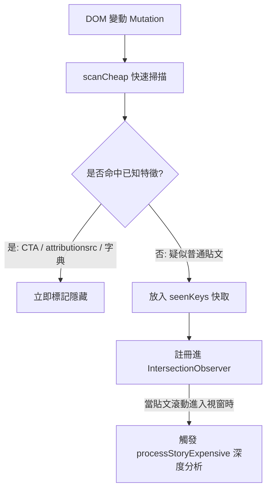

# Feed Filter for Facebook (fff v1.6.2) — 逆向工程與架構深度剖析

本文檔針對解包擴充套件 **Feed Filter for Facebook**（內部代碼標記為 `fff`，版本 `1.6.2`）進行架構與代碼追蹤（Trace Code）。

該專案是運用 **Chrome Privacy Sandbox 特徵、雙層環境架構、分級 IntersectionObserver 以及側邊欄保護白名單** 的典型代表。

---

## 1. 架構全景概覽 (Architecture Overview)

- **Manifest V3 雙層 World 架構**：
  - `ISOLATED World` ([content-bridge.js](file:///c:/Users/flow/Documents/我的git/Chrome%20extension/ref/feed-filter-for-facebook/content-bridge.js))：專責監聽 `chrome.storage.sync` 設定，並透過 `window.postMessage` 與 MAIN 溝通。
  - `MAIN World` ([content.js](file:///c:/Users/flow/Documents/我的git/Chrome%20extension/ref/feed-filter-for-facebook/content.js))：注入在主世界執行核心判定與樣式管理。
- **過濾設計哲學**：
  - **預渲染 CSS 阻斷（CSS Guard）**：利用現代瀏覽器 `:has()` 偽類在貼文繪製前直接依屬性隱藏，消除視覺跳動。
  - **雙階掃描機制 (Two-Tier Scanning)**：將過濾分為 `Cheap`（全域快速掃描）與 `Expensive`（僅在進入視窗時由 `IntersectionObserver` 觸發）。
  - **防誤殺保護區**：右側欄嚴格排除聯絡人（Contacts）與聊天室列表。

---

## 2. 核心技術特徵剖析

### 1. 預防閃爍的 CSS Guard 選擇器 (`content.css`)
```css
html:not(.fff-allow-sponsored) [aria-posinset]:has([data-ad-rendering-role^="cta"]),
html:not(.fff-allow-sponsored) [aria-posinset]:has([attributionsrc*="/privacy_sandbox/comet/register/source/"]),
html:not(.fff-allow-sponsored) [aria-posinset]:has([aria-label*="sponsored content" i]),
html:not(.fff-allow-sponsored) #right_rail_container div:has(a[target^="rhcad"]):not(:has(a[href*="/messages/"])) {
  display: none !important;
}
```
- **特點**：在 HTML 尚未完成 React 渲染時，只要命中特定屬性，立即套用 `display: none !important`，並加上 `overflow-anchor: none` 防止瀏覽器因高度驟減而產生滾動跳躍。
- **屬性依據**：
  - `attributionsrc*="/privacy_sandbox/comet/register/source/"`：Chrome Privacy Sandbox 歸因回傳標記。
  - `data-ad-rendering-role^="cta"`：行動呼籲按鈕（例如立即購買、註冊）。

### 2. 雙階觀測器 (Cheap vs. Expensive via IntersectionObserver)

- **優勢**：絕不在一瞬間對動態牆數十篇離屏（Off-screen）貼文執行高開銷的 DOM 深度遍歷，僅在使用者快滑到該貼文時才喚醒重量級判定，大幅降低捲動時的 CPU 佔用率。

### 3. 右側欄好友保護機制 (`isProtectedRailHeading`)
右側欄（Right Rail）往往緊鄰聊天室聯絡人清單（Contacts）。許多粗糙的擴充套件因誤認側邊欄容器而直接隱藏整個通訊錄。

fff 設計了嚴格的保護正規表示式：
```javascript
const CONTACTS_HEADING_RE = /^(contacts|kontakte|contactos|contatti|kontakter|kontakty|контакти)\b/i;
const GROUP_CHATS_HEADING_RE = /^(group chats|gruppenchats|chats de grupo|chat di gruppo|групови чатове)\b/i;

function hideRailElement(el) {
  if (isProtectedRailHeading(el.textContent || "")) return false; // 永不隱藏聯絡人
  // ... 執行廣告外框隱藏
}
```

### 4. 記憶體短期持久化 (`sessionStorage` 儲存 150 筆)
將已判定為廣告的識別金鑰（`identityKey`）暫存於 `sessionStorage`：
- 在用戶快速來回滾動或 SPA 切換時，已判定的貼文能直接在 0 毫秒內 O(1) 隱藏，無需重新匹配詞庫。

---

## 3. 與 FB Diet 的深度技術對比

| 比較維度 | Feed Filter for Facebook (`fff`) | FB Diet (本專案) |
| :--- | :--- | :--- |
| **判定依據** | `attributionsrc`、CTA 屬性、短詞比對 | **Relay Store 記憶體資料 (`ad_id`, `CAN_SUBSCRIBE`)** |
| **視覺呈現** | `display: none !important` 暴力抹除 | **設計精緻的平滑摺疊列（Fold Bar）** |
| **隱藏時機** | CSS Guard 提前遮蔽 + IntersectionObserver | **React 組件渲染攔截（Pre-render Hook）** |
| **誤殺防範** | 依賴卡片尺寸限制 (360px~920px) 與標題白名單 | **結構白名單 + Relay 資料真實狀態** |

---

## 4. FB Diet 可借鑑的精華技巧

1. **側邊欄聯絡人保護字典**：
   FB Diet 未來若擴展桌面版右側欄（`CometAdsSideFeedUnitItem`）時，可採用其多語系 `CONTACTS_HEADING_RE` 確保絕對不會干擾 Messenger 聯絡人抽屜。
2. **`IntersectionObserver` 延遲決策**：
   在純 DOM Fallback 模式下，採用雙階（Cheap / Expensive）分離，能將 CPU 負載精準控制在可見視窗內。
