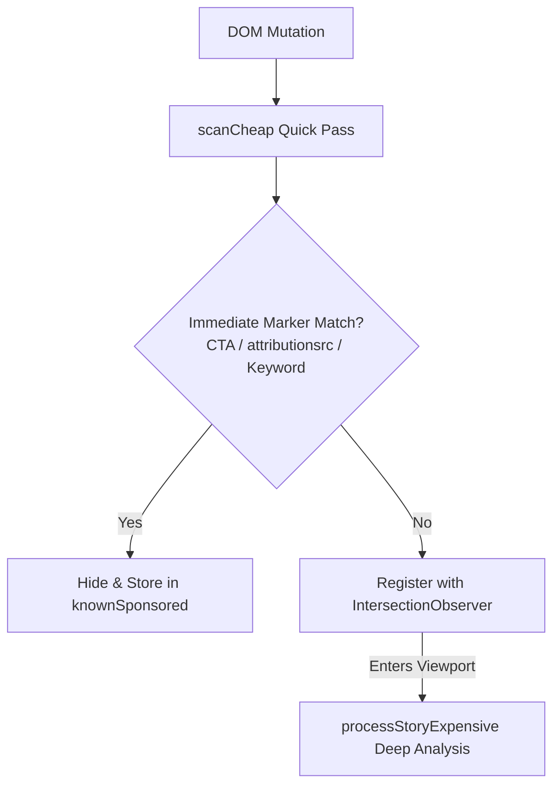

# Feed Filter for Facebook (fff) — Architectural Teardown

- **Project**: `Feed Filter for Facebook` (Internal identifier: `fff`)
- **Analyzed Version**: `v1.6.2`
- **Source Artifact**: CRX unpacked distribution (`feed-filter-for-facebook`) / Web Store

---

## 1. Architecture Overview

- **Manifest V3 Dual-World Design**:
  - `ISOLATED World` ([content-bridge.js](file:///c:/Users/flow/Documents/我的git/Chrome%20extension/ref/feed-filter-for-facebook/content-bridge.js)): Manages `chrome.storage.sync` and bridges configuration via `window.postMessage`.
  - `MAIN World` ([content.js](file:///c:/Users/flow/Documents/我的git/Chrome%20extension/ref/feed-filter-for-facebook/content.js)): Executes core DOM classification, CSS rule injection, and viewport intersection tracking.
- **Core Strategy**:
  - **Pre-paint CSS Guards**: Uses `:has()` to hide ad containers before React hydration completes, preventing layout flash.
  - **Two-Tier Scanning**: Separates rapid initial checks (`scanCheap`) from expensive DOM traversal deferred to `IntersectionObserver`.
  - **Contacts Protection**: Explicit regex whitelisting for Messenger contacts in the right rail.

---

## 2. Key Mechanisms

### 1. Pre-paint CSS Guards (`content.css`)
```css
html:not(.fff-allow-sponsored) [aria-posinset]:has([data-ad-rendering-role^="cta"]),
html:not(.fff-allow-sponsored) [aria-posinset]:has([attributionsrc*="/privacy_sandbox/comet/register/source/"]),
html:not(.fff-allow-sponsored) [aria-posinset]:has([aria-label*="sponsored content" i]),
html:not(.fff-allow-sponsored) #right_rail_container div:has(a[target^="rhcad"]):not(:has(a[href*="/messages/"])) {
  display: none !important;
}
```
- Targets Chrome Privacy Sandbox attribution endpoints and explicit CTA roles to collapse units before layout computation.
- Applies `overflow-anchor: none` to suppress browser scroll-anchoring jitter.

### 2. Two-Tier Viewport Classification

- Restricts expensive style/DOM lookups strictly to cards currently near the visible viewport.

### 3. Right Rail Chat Whitelist (`isProtectedRailHeading`)
Guards against accidental suppression of Messenger contacts:
```javascript
const CONTACTS_HEADING_RE = /^(contacts|kontakte|contactos|contatti|kontakter|kontakty|контакти)\b/i;
const GROUP_CHATS_HEADING_RE = /^(group chats|gruppenchats|chats de grupo|chat di gruppo)\b/i;

function hideRailElement(el) {
  if (isProtectedRailHeading(el.textContent || "")) return false; // Never hide contacts
  // ... proceed with ad suppression
}
```

### 4. Ephemeral Identity Cache (`sessionStorage`)
Caches the last 150 classified story identity keys in `sessionStorage` (`fff-known-v2`), providing O(1) instantaneous suppression upon page re-navigation.

---

## 3. Architecture Evaluation & Trade-offs

### Strengths
- **Zero-Flash Pre-paint**: Pure CSS `:has()` rules collapse high-probability ads before JS evaluation or React reconciliation finishes.
- **Efficient Viewport Throttling**: Deferring second-stage deep checks to `IntersectionObserver` keeps scroll performance close to 60 FPS.
- **Fail-Safe Messenger Protection**: Multi-language heading regex ensures sidebar chat lists are never accidentally obliterated.

### Limitations
- **Over-Reliance on `data-ad-rendering-role`**: As documented in other ad-blocker research, `data-ad-rendering-role^="cta"` and general ad-roles can appear on organic group and buy-and-sell posts, risking occasional false positives.
- **Brittle to Class & Attribute Renames**: When Facebook modifies Privacy Sandbox telemetry endpoints or drops CTA role attributes, CSS rules silently lose efficacy.
